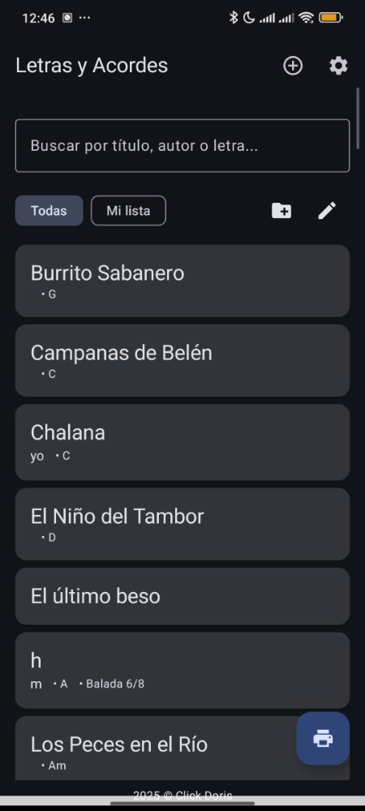
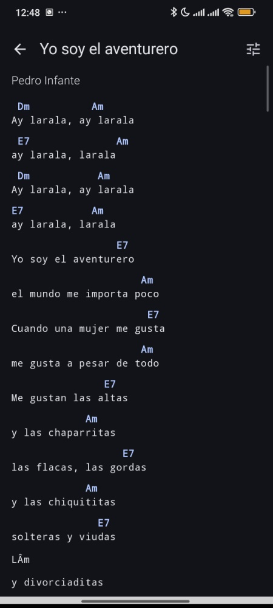
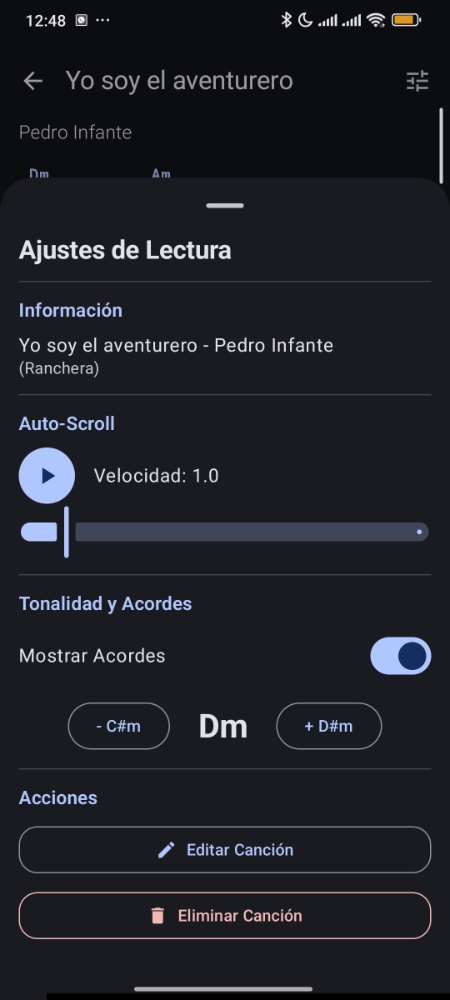

# 🎸 Melodias: Letras y Acordes (v2.4.8)

**Melodias** es una potente herramienta para músicos que permite gestionar cancioneros digitales de forma profesional. Más que un simple visor, es un asistente completo para ensayos y presentaciones en vivo.

---

## 📱 Vista Previa del Proyecto
Aquí puedes ver las funciones principales en acción:

| Gestión y Listas | Visor Inteligente | Herramientas de Lectura |
|:---:|:---:|:---:|
|  |  |  |
| *Buscador y Categorías* | *Acordes alineados* | *Transposición y Scroll* |

---

## ✨ Funciones Destacadas

### 🎼 Visor y Editor Avanzado
* **Alineación Precisa:** Los acordes se mantienen exactamente sobre la sílaba correspondiente.
* **Transpositor en Tiempo Real:** Cambia la tonalidad de cualquier canción con un solo toque (ej: de Dm a C#m).
* **Importación Inteligente:** Soporte para agregar canciones mediante texto, con detección de contenido existente.
* **OCR / Multimedia:** Iconos de cámara y galería listos para integración de escaneo de letras.

### 📄 Exportación a PDF (Cancionero)
* Generación de documentos PDF profesionales.
* **Modo Compacto:** Ahorra papel permitiendo canciones seguidas.
* **Personalización:** Opción de incluir o quitar acordes e índice automático en el documento final.

### ⏱️ Herramientas de Performance
* **Auto-Scroll:** Desplazamiento automático ajustable por velocidad (1.0x, etc.) para tocar sin tocar la pantalla.
* **Gestión de Listas:** Crea y edita categorías personalizadas (Playlists) para tus eventos o ensayos.

---

## 🛠️ Detalles Técnicos
* **Versión Actual:** 2.4.8
* **Lenguaje:** Kotlin
* **Persistencia:** Gestión de cancioneros locales.
* **UI:** Interfaz moderna con soporte para Modo Oscuro y controles dinámicos.

## 🚀 Próximos Pasos (WIP)
* [ ] Optimizaciones de rendimiento en listas largas.

---

## 👤 Autor
Desarrollado por **Cristopher (MyAstron)**.
*© 2025 Click Doris / MyAstron*
